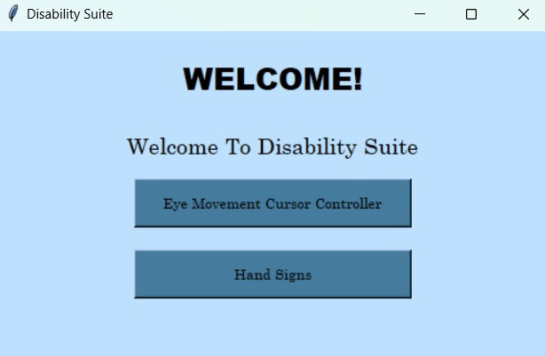
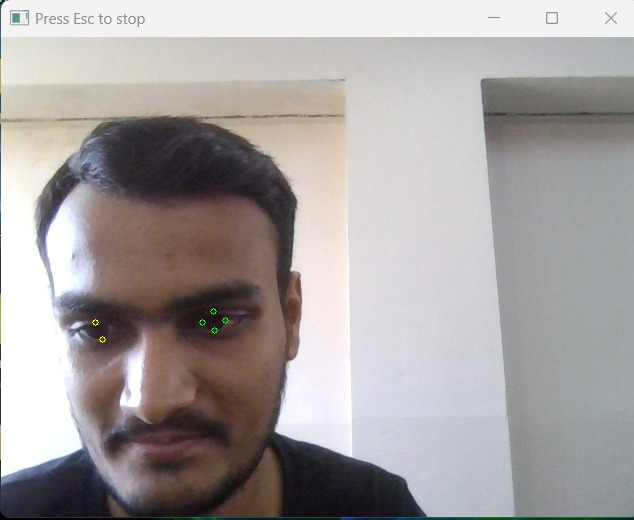
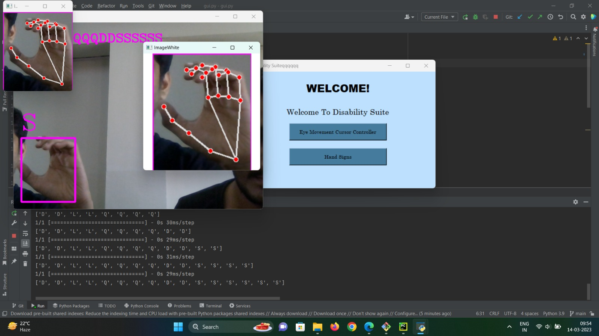
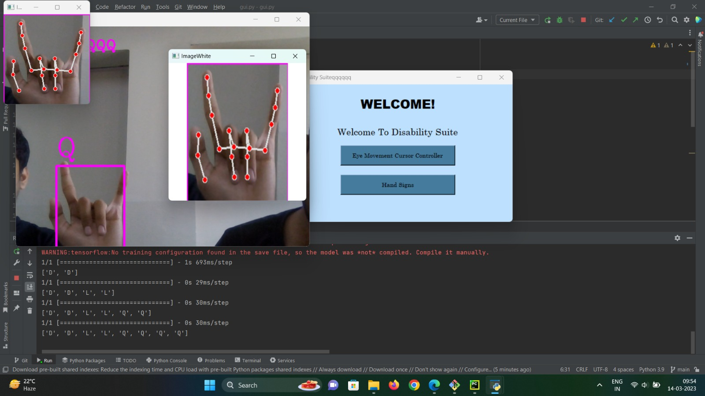

# Disability Suite
<h2>An utility software to help disabled people conveniently use their Personal Computers</h2>
<h2>Requirements</h2>

Just CLONE this repo and launch gui.py & install the modules alerted. (One time install)

 
<h2>UI</h2>
 

 
<h2>Head tracked cursor</h2>
 

 
<h2>ASL recogniser</h2>
 

